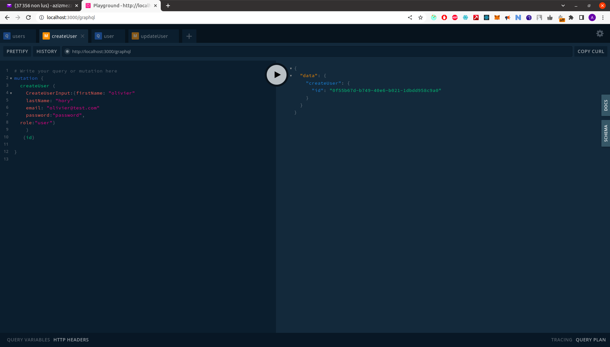
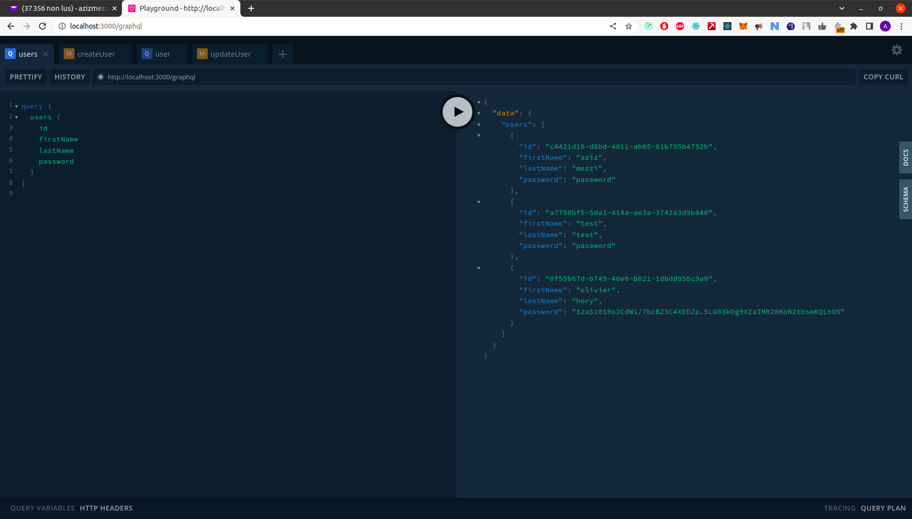
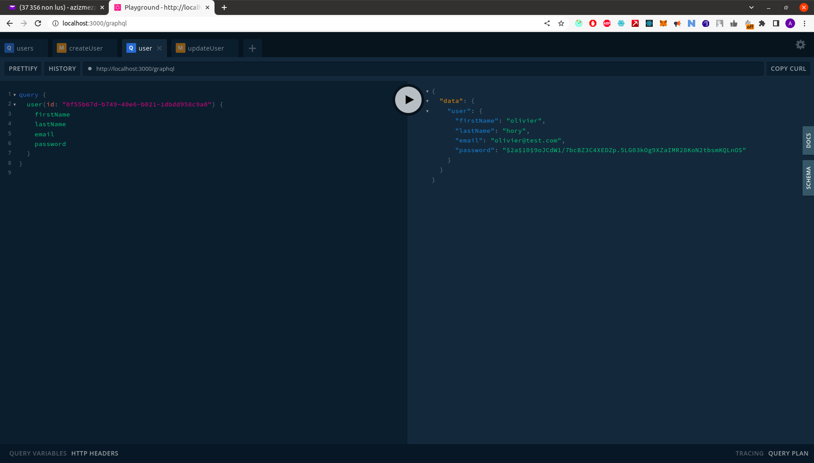
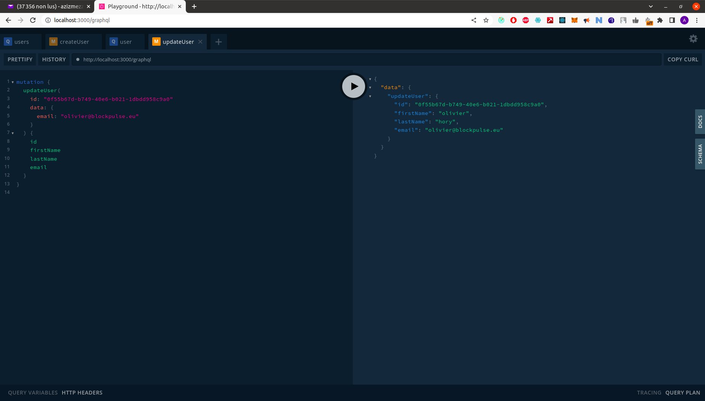

# User platform 
## Description

This project is a NestJS-based API that provides user management functionality using GraphQL and Postgres. The API allows for creating, reading and updating users.

The API uses a Postgres database to store user information, and provides a GraphQL interface for querying and manipulating user data. It uses the TypeORM library for ORM functionality, and includes a custom GraphQL resolver and service layer for handling user-related logic.

## Getting Started
To run the API, first clone the repository and install the necessary dependencies:


```bash
git clone https://github.com/azizmezzi/user-management-api.git
cd user-management-api
npm install
```

Next, create a .env file in the root directory of the project and add the necessary environment variables for connecting to your Postgres database. You can use the .env.example file as a starting point.

### Running Migrations


Before starting the API, you need to apply the database migrations. To do this, run the following command:

```bash

npm run migration:run

```
This command will apply any pending migrations to the database specified in the .env file. 

### start project

Once you have set up your database, you can start the API using the start:dev command:
```bash

npm run start:dev

```

This will start the API on http://localhost:3000/graphql.

## API Documentation

The API provides a GraphQL interface for querying and manipulating user data. You can access the API documentation by navigating to http://localhost:3000/graphql in your browser.


## Testing

To run the tests for the API, use the test command:

```bash

npm run test

```

This will run the unit tests for the API and output the results to the console.

## Examples

### Get all users
To get a list of all users, you can send the following GraphQL query and get this result :
```bash
query {
  users {
    id
    firstName
    lastName
    password
    email
  }
}
```


### Create a new user
To create a new user, you can send the following GraphQL mutation and get this result and you can see the new list of users:
```bash
mutation {
  createUser ( 
    CreateUserInput:{firstName: "olivier"
    lastName: "hory"
    email: "olivier@test.com"
  	password:"password",
  role:"user"}
    )
   {id}
  
}

```




### Get a user by ID
To get a specific user by their ID, you can send the following GraphQL query, eplacing "0f55b67d-b749-40e6-b021-1dbdd958c9a0" with the ID of the user you want to retrieve:
```bash
query {
  user(id: "0f55b67d-b749-40e6-b021-1dbdd958c9a0") {
    firstName
    lastName
    email
    password
  }
}

```



### Update a user

To update a user's information, you can send the following GraphQL mutation, replacing "0f55b67d-b749-40e6-b021-1dbdd958c9a0" with the ID of the user you want to update:
```bash
query {
  user(id: "0f55b67d-b749-40e6-b021-1dbdd958c9a0") {
    firstName
    lastName
    email
    password
  }
}

```



